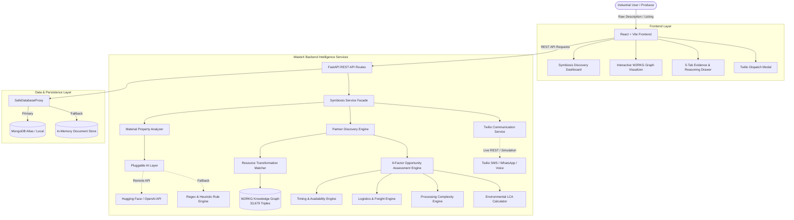

# WasteX + W2RKG — Industrial Symbiosis Intelligence Platform

> **An AI-assisted, knowledge-graph-driven platform for discovering, assessing, and connecting hidden cross-sector industrial resource-exchange opportunities.**

---

## Table of Contents

1. [Problem Statement](#1-problem-statement)
2. [Solution Overview](#2-solution-overview)
3. [Key Features](#3-key-features)
4. [High-Level Architecture](#4-high-level-architecture)
5. [End-to-End Runtime Data Flow](#5-end-to-end-runtime-data-flow)
6. [Detailed Module Architecture](#6-detailed-module-architecture)
7. [Complete Repository Structure](#7-complete-repository-structure)
8. [Tech Stack](#8-tech-stack)
9. [API Documentation](#9-api-documentation)
10. [Data Models](#10-data-models)
11. [W2RKG Knowledge Graph Architecture](#11-w2rkg-knowledge-graph-architecture)
12. [AI & LLM Architecture](#12-ai--llm-architecture)
13. [9-Factor Opportunity Scoring Mathematics](#13-9-factor-opportunity-scoring-mathematics)
14. [Logistics & Transportation Formulation](#14-logistics--transportation-formulation)
15. [Environmental Life-Cycle Assessment (LCA) Engine](#15-environmental-life-cycle-assessment-lca-engine)
16. [Environment Configuration](#16-environment-configuration)
17. [Installation & Setup](#17-installation--setup)
18. [Running the Application](#18-running-the-application)
19. [Testing & Verification](#19-testing--verification)
20. [Frontend Production Build](#20-frontend-production-build)
21. [End-to-End Walkthrough Scenario](#21-end-to-end-walkthrough-scenario)
22. [Error Handling & Input Validation](#22-error-handling--input-validation)
23. [Security & Privacy](#23-security--privacy)
24. [Verified System Status](#24-verified-system-status)
25. [Project Strengths](#25-project-strengths)
26. [Known Limitations](#26-known-limitations)
27. [Future Enhancements](#27-future-enhancements)
28. [Hackathon Demo Script](#28-hackathon-demo-script)
29. [Comparison: Waste Marketplace vs. Symbiosis Intelligence](#29-comparison-waste-marketplace-vs-symbiosis-intelligence)
30. [License & Attribution](#30-license--attribution)

---

## 1. Problem Statement

### **Problem Statement 1: "Discovering Hidden Industrial Symbiosis"**

Every day, heavy industrial plants, chemical refineries, thermal power stations, and manufacturing complexes generate hundreds of thousands of tonnes of residual by-products, process off-gasses, sludges, and mineral ashes. While these materials are classified as "industrial waste" by the originating producer and destined for landfilling or incineration, they frequently contain valuable physical and chemical properties capable of directly substituting virgin raw materials in secondary industries.

However, establishing industrial symbiosis partnerships is traditionally blocked by complex multi-dimensional friction:

1. **Material Identification:** What secondary raw materials can this specific byproduct replace?
2. **Cross-Sector Discovery:** Which non-obvious industrial sectors (e.g., thermal power $\rightarrow$ cement manufacturing) have demand for this material?
3. **Quantity Matching:** Does the producer's supply volume match the receiver's required intake volume?
4. **Physical & Chemical Quality:** Does the moisture level, fineness, pH, or purity satisfy industrial receiver standards?
5. **Temporal Availability:** Do the producer’s generation cycle and the receiver’s intake schedule overlap in time?
6. **Geographic & Logistics Feasibility:** Is the transit distance economically viable given road freight tariffs and vehicle constraints?
7. **Processing Requirements:** Does the waste stream require specialized pre-sorting, drying, or grinding before intake?
8. **Quantified Ecological Benefit:** Does the substitution generate a provable net reduction in greenhouse gas emissions ($\text{CO}_2\text{e}$) after deducting haulage transport emissions?

---

## 2. Solution Overview

**WasteX + W2RKG** solves this challenge by unifying:
1. **WasteX:** A B2B digital circular economy platform with waste listings, direct buyer discovery, and user management.
2. **AI Material Analyzer:** Natural language understanding engine extracting physical, chemical, and scheduling parameters with explicit provided-vs-inferred demarcation.
3. **W2RKG (Waste-to-Resource Knowledge Graph):** A graph engine storing **33,679 scientific transformation triples** connecting industrial waste streams to secondary raw materials and processes.
4. **Partner Discovery Engine:** Cross-industry matchmaking engine mapping waste streams to platform users and cross-sector industrial entities.
5. **Multi-Factor Opportunity Assessment Engine:** A deterministic, transparent 9-factor scoring model synthesizing operational feasibility into an explainable 0–100 score.
6. **Timing Engine:** Temporal availability and scheduling overlap calculator evaluating supply-demand synchronicity.
7. **Logistics Feasibility Engine:** Haversine distance calculator with road winding factors, vehicle mode selection, freight tariffs, and transit duration estimates.
8. **Processing Requirement Engine:** Industrial preprocessing analyzer evaluating technical complexity and receiver direct-intake readiness.
9. **Environmental Impact Calculator:** Configurable LCA carbon accounting model reporting gross avoided emissions, logistics freight footprint, and net avoided $\text{CO}_2\text{e}$.
10. **Twilio Multi-Channel Communication:** Multi-channel outreach dispatcher supporting SMS, WhatsApp, and Voice calls. Runs in live mode when credentials are configured, and in a safe simulation mode when they are not.

---

## 3. Key Features

- **Conversational Material Intake:** Natural language input parsing (e.g., *"We generate 5000 kg of dry fly ash every month in Mumbai"*).
- **Explicit Property Demarcation:** Clearly differentiates explicitly stated user facts from domain-inferred estimates to prevent hallucination.
- **W2RKG Graph Traversal:** Traverses 33,679 scientific peer-reviewed triples to discover valid transformation pathways and virgin material substitutes.
- **Multi-Sector Cross-Matching:** Benchmark coverage across 10 major industrial sectors: *Cement, Construction, Textile, Chemical, Food Processing, Metal / Foundry, Plastic, Paper / Pulp, Agriculture, and Manufacturing*.
- **9-Factor Explainable Scoring:** Transparent composite score (0–100%) computed via strict weighted mathematical sum.
- **Operational Timing Analysis:** Evaluates recurring dispatch cycles (daily, weekly, monthly, batch) and computes precise day-overlap buffers.
- **Logistics & Freight Calculation:** Auto-selects vehicle types (Pneumatic Silo Bulkers, Liquid Tankers, Hydraulic Tippers, LCVs), computes road freight in INR (₹), and transit hours.
- **Processing Complexity Evaluation:** Grades conversion processes as *Low*, *Medium*, or *High* complexity with explicit required preparation steps.
- **Quantified LCA Carbon Accounting:** Calculates landfill diversion and net avoided greenhouse gases using IPCC and EPA emission factors.
- **Interactive SVG Knowledge Graph:** Visualizes multi-hop resource transformation networks directly in the web browser.
- **5-Tab Evidence Drawer:** Provides detailed drill-down tabs (*Overview*, *Timing*, *Logistics*, *Processing*, *Environmental*) answering *"Why is this an opportunity?"*.
- **Multi-Channel Twilio Dispatch:** Instant outreach via Twilio SMS, WhatsApp, and synthesized Voice Calls.
- **Honest Delivery Reporting:** A live dispatch rejected by Twilio returns `success: false` with the provider's actual error, never a fabricated success receipt. Simulation mode is reserved for genuinely unconfigured environments.
- **Graceful Fault Tolerance:** Operates with in-memory database fallback if MongoDB is unavailable and deterministic NLP extraction if remote AI inference is unreachable.

---

## 4. High-Level Architecture



---

## 5. End-to-End Runtime Data Flow

```
[User Natural Description]
           │
           ▼
[STEP 1: User Input]
"We generate 5000 kg of dry fly ash every month with 8% moisture in Mumbai."
           │
           ▼
[STEP 2: API Ingestion]
POST /api/symbiosis/material-analysis
           │
           ▼
[STEP 3: SymbiosisService Facade]
Coordinates analysis, partner discovery, opportunity scoring, and communications.
           │
           ▼
[STEP 4: Material Property Analyzer]
Structures physical form (powder), condition (dry), moisture (8%), quantity (5000 kg),
and frequency (monthly). Categorizes verified provided vs. inferred properties.
           │
           ▼
[STEP 5: AI Layer & Fallback Pipeline]
Calls Hugging Face InferenceClient (meta-llama/Llama-3.2-1B-Instruct).
If remote API is unreachable, executes deterministic rule & pattern extraction.
           │
           ▼
[STEP 6: W2RKG Knowledge Graph Traversal]
Fuzzy-matches query to KG nodes; queries 33,679 triples.
Discovers transformation: Fly Ash → Portland Cement Clinker Substitution.
           │
           ▼
[STEP 7: Resource Matching]
Identifies target industrial applications: Cement blending, AAC brick foaming, Aggregate.
           │
           ▼
[STEP 8: Partner Discovery]
Scans platform registered consumers and benchmark cross-industry partners.
Identifies: UltraTech Cement Corp. (Cement Manufacturer, Pune).
           │
           ▼
[STEP 9: Operational Subsystems Evaluation]
├── Timing Engine: Days 1–10 vs Days 1–15 (10-day overlap -> Timing Compatible, Score: 95.0)
├── Logistics Engine: Mumbai to Pune = 145.7 km road -> Pneumatic Silo Bulker (Est. ₹3,276, 6.0 hrs)
├── Processing Engine: Dry powder screening (<45 µm) -> Low Complexity, Direct Intake = True
└── Environmental Engine: 5,000 kg Fly Ash replaces 4,750 kg virgin clinker -> Net 3.808 t CO2e avoided
           │
           ▼
[STEP 10: 9-Factor Opportunity Scoring Engine]
Calculates deterministic weighted sum:
(100×0.22) + (96×0.16) + (96×0.12) + (90×0.10) + (95×0.10) + (92×0.10) + (95×0.08) + (80.3×0.07) + (96×0.05)
= 94.6% Opportunity Score
           │
           ▼
[STEP 11: Evidence Synthesis]
Generates human-readable evidence points explaining why this opportunity is viable.
           │
           ▼
[STEP 12: Twilio Notification Dispatch]
POST /api/symbiosis/notify -> Dispatches SMS / WhatsApp / Voice notification.
```

---

## 6. Detailed Module Architecture

| Module | Location | Responsibility | Primary Inputs | Primary Outputs |
| :--- | :--- | :--- | :--- | :--- |
| **Knowledge Graph Engine** | `backend/services/symbiosis/knowledge_graph/kg_engine.py` | Loads, indexes, and queries 33,679 triples via NetworkX | Entity query string, similarity threshold | Matching waste nodes, possible uses, subgraph elements |
| **AI Layer** | `backend/services/symbiosis/ai/ai_layer.py` | Pluggable LLM interface (Hugging Face / OpenAI) with fallback | System prompt, user prompt, max tokens | Structured JSON metadata, strategic text insights |
| **Material Property Analyzer** | `backend/services/symbiosis/material_analysis/material_analyzer.py` | Natural text structuring and provided vs. inferred property tagging | Text prompt, optional quantity, location | Structured material profile dictionary |
| **Resource Matcher** | `backend/services/symbiosis/resource_matching/resource_matcher.py` | Maps waste streams to secondary industrial resources | Material name, physical form, condition | Enriched potential resource uses list |
| **Partner Discovery Engine** | `backend/services/symbiosis/partner_discovery/partner_engine.py` | Multi-industry candidate partner matching and graph construction | Material profile, location, quantity, top_k | Ranked potential partners, network graph data |
| **Timing Engine** | `backend/services/symbiosis/timing/timing_engine.py` | Evaluates temporal compatibility and dispatch/intake day overlap | Quantities, frequencies, availability windows | Timing score, overlap days, compatibility status |
| **Logistics Engine** | `backend/services/symbiosis/logistics/logistics_engine.py` | Haversine distance, road winding factor, vehicle mode, freight tariff | Origin, destination, quantity, physical form | Distance km, transport mode, freight INR, transit hours |
| **Processing Engine** | `backend/services/symbiosis/processing/processing_engine.py` | Preprocessing requirements, complexity grading, direct intake check | Waste material, target resource, condition | Preprocessing steps, complexity, processing score |
| **Environmental Calculator** | `backend/services/symbiosis/environmental/impact_calculator.py` | Quantified LCA carbon accounting with scientific emission factors | Material name, quantity kg, transit distance | Landfill diverted, gross avoided, freight CO2, net saved |
| **Opportunity Assessment Engine** | `backend/services/symbiosis/opportunity/opportunity_engine.py` | Synthesizes all 9 factors into explainable 0–100 composite score | Producer info, partner info, material profile, pathway | 9-factor breakdown, final score, evidence list |
| **Twilio Communication Service** | `backend/services/communication/twilio_service.py` | Dispatches multi-channel SMS, WhatsApp, and Voice notifications | Channel, recipient phone, message text | Dispatch receipt dictionary, SID, delivery status |
| **Symbiosis Service Facade** | `backend/services/symbiosis/symbiosis_service.py` | High-level orchestrator coordinating end-to-end symbiosis intelligence | Request parameters, database handle | Complete discovery payload |

---

## 7. Complete Repository Structure

```
W2RKG_application-main/
├── README.md                                  # Root project documentation
├── wasteX-main/                               # Main application root
│   ├── README.md                              # Application documentation
│   ├── .gitignore                             # Git ignore rules (ignoring .env, node_modules, pycache)
│   ├── docs/
│   │   └── project_documentation.md           # Technical project notes and specifications
│   │
│   ├── backend/                               # FastAPI Python Backend
│   │   ├── main.py                            # Application entrypoint & CORS middleware
│   │   ├── routes.py                          # Unified REST API router for WasteX and Symbiosis
│   │   ├── models.py                          # Pydantic request/response schemas and validators
│   │   ├── database.py                        # MongoDB client with in-memory fallback proxy
│   │   ├── requirements.txt                   # Backend Python dependencies
│   │   ├── .env.example                       # Environment template with safe placeholders
│   │   │
│   │   ├── data/                              # W2RKG Knowledge Graph Datasets
│   │   │   ├── fused_triples_aggregated.json  # 33,679 fused scientific transformation triples
│   │   │   ├── w2rkg_waste_list.txt           # 3,440 unique indexed waste entities
│   │   │   ├── w2rkg_resource_list.txt        # 4,369 unique indexed transformed resources
│   │   │   ├── Maestri_all.csv                # Industrial symbiosis benchmark database
│   │   │   └── Maestri_profiles_*.json        # Sectoral transformation profiles
│   │   │
│   │   ├── services/                          # Core Business & Intelligence Services
│   │   │   ├── communication/
│   │   │   │   └── twilio_service.py          # Twilio SMS, WhatsApp, and Voice calling engine
│   │   │   │
│   │   │   └── symbiosis/                     # Problem Statement 1 Intelligence Subsystem
│   │   │       ├── symbiosis_service.py       # High-level orchestrator facade
│   │   │       ├── ai/
│   │   │       │   └── ai_layer.py            # Hugging Face & OpenAI LLM abstraction layer
│   │   │       ├── material_analysis/
│   │   │       │   └── material_analyzer.py   # AI material profiling & property extractor
│   │   │       ├── knowledge_graph/
│   │   │       │   └── kg_engine.py           # NetworkX graph engine & fuzzy similarity matcher
│   │   │       ├── resource_matching/
│   │   │       │   └── resource_matcher.py    # Waste-to-resource transformation finder
│   │   │       ├── partner_discovery/
│   │   │       │   └── partner_engine.py      # Cross-industry partner discovery engine
│   │   │       ├── timing/
│   │   │       │   └── timing_engine.py       # Temporal availability & schedule overlap engine
│   │   │       ├── logistics/
│   │   │       │   ├── logistics_engine.py    # Freight tariffs, vehicle selector & transit model
│   │   │       │   └── geo_data.py            # Coordinate registry for industrial cities/zones
│   │   │       ├── processing/
│   │   │       │   └── processing_engine.py   # Preprocessing complexity & technical analyzer
│   │   │       ├── environmental/
│   │   │       │   └── impact_calculator.py   # LCA emission factors & net CO2e carbon calculator
│   │   │       ├── opportunity/
│   │   │       │   └── opportunity_engine.py  # 9-Factor opportunity assessment & scoring engine
│   │   │       └── compatibility/
│   │   │           └── compatibility_scorer.py# Geometric compatibility evaluation utilities
│   │   │
│   │   └── tests/                             # Automated Pytest Test Suite
│   │       ├── test_negative_and_edge_cases.py# 17 edge cases, boundary checks, and validations
│   │       ├── test_compatibility_scorer.py  # Geometric compatibility unit tests
│   │       ├── test_impact_calculator.py      # Carbon LCA calculation unit tests
│   │       ├── test_kg_engine.py              # Knowledge graph loading and traversal tests
│   │       ├── test_logistics_engine.py       # Logistics routing and vehicle mode tests
│   │       ├── test_material_analyzer.py      # Material NLP structuring tests
│   │       ├── test_partner_discovery.py      # Cross-industry partner matchmaking tests
│   │       ├── test_processing_engine.py      # Preprocessing complexity tests
│   │       ├── test_symbiosis_api.py          # FastAPI endpoint integration tests
│   │       ├── test_timing_engine.py          # Schedule overlap and timing conflict tests
│   │       └── test_twilio_service.py         # Multi-channel Twilio dispatch tests
│   │
│   └── frontend/                              # React 19 + Vite Frontend
│       ├── package.json                       # Frontend dependencies and scripts
│       ├── vite.config.js                     # Vite build configuration
│       ├── index.html                         # Single-page application root HTML
│       ├── .env.example                       # Frontend environment template
│       └── src/
│           ├── main.jsx                       # Application bootstrap
│           ├── App.jsx                        # React Router configuration
│           ├── index.css                      # Tailwind CSS v4 styling rules
│           ├── firebase.js                    # Firebase Auth integration
│           │
│           ├── context/
│           │   └── AuthContext.jsx            # User authentication state provider
│           │
│           ├── components/
│           │   ├── Navbar.jsx                 # Navigation header with Symbiosis AI link
│           │   ├── Footer.jsx                 # Platform footer
│           │   ├── Chatbot.jsx                # Circular economy AI chat assistant
│           │   └── SymbiosisNetworkGraph.jsx  # Interactive SVG Network Graph Visualizer
│           │
│           └── pages/
│               ├── SymbiosisDiscovery.jsx     # Industrial Symbiosis Opportunity Dashboard
│               ├── Home.jsx                   # Marketplace homepage and search
│               ├── CreateListing.jsx          # Waste listing creation interface
│               ├── ListingDetails.jsx         # Detailed listing view with embedded match
│               ├── NearbyBuyers.jsx           # Local buyer proximity search
│               └── Login.jsx                  # User login and authentication
```

---

## 8. Tech Stack

| Layer | Technology | Version / Specification | Purpose in Project |
| :--- | :--- | :--- | :--- |
| **Frontend Framework** | React | `^19.2.8` | Component-based reactive UI rendering |
| **Frontend Tooling** | Vite | `^8.3.0` | Fast local development server and production bundler |
| **Routing** | React Router DOM | `^7.18.4` | Client-side routing across discovery and marketplace pages |
| **Styling** | Tailwind CSS | `^4.3.3` | Modern utility-first responsive styling and typography |
| **Icons** | Lucide React | `^1.46.0` | Clean industrial and system UI vector iconography |
| **HTTP Client** | Axios | `^1.20.0` | Browser-to-backend REST API communication |
| **Backend Framework**| FastAPI | `>=0.110.0` | High-performance asynchronous Python API framework |
| **ASGI Server** | Uvicorn | `>=0.28.0` | Production ASGI web server hosting FastAPI |
| **Data Validation** | Pydantic | `>=2.6.0` | Strict data validation, typing, and schema enforcement |
| **Graph Modeling** | NetworkX | `>=3.2.0` | Graph representation of 33,679 transformation triples |
| **String Similarity** | RapidFuzz | `>=3.6.0` | High-speed C++ token-set string matching for entity resolution |
| **AI Inference** | `huggingface_hub` | `>=0.21.0` | Python client for remote LLM inference (Llama-3.2-1B-Instruct) |
| **Alternative AI** | HTTPX / OpenAI | `>=0.27.0` | Asynchronous client for OpenAI-compatible LLM endpoints |
| **Communications** | Twilio SDK | `>=9.0.0` | Enterprise multi-channel dispatch: SMS, WhatsApp, Voice Calls |
| **Database Driver** | PyMongo | `>=4.6.0` | MongoDB driver with graceful in-memory proxy fallback |
| **Testing** | Pytest | `>=8.0.0` | Automated test runner with comprehensive edge test suite |

---

## 9. API Documentation

### 1. AI Material & Property Analysis
- **Method:** `POST`
- **Path:** `/api/symbiosis/material-analysis`
- **Description:** Parses natural language descriptions into verified structured profiles, clearly isolating provided facts from inferred estimates.

#### Request Body
```json
{
  "description": "We generate 5000 kg of dry fly ash every month with 8% moisture in Mumbai.",
  "quantity": 5000.0,
  "quantity_unit": "kg",
  "frequency": "monthly",
  "location": "Mumbai, Maharashtra"
}
```

#### Response Body (`200 OK`)
```json
{
  "material_name": "Fly Ash",
  "material_category": "Cement",
  "quality_grade": "Class F (Siliceous Pozzolan)",
  "physical_properties": {
    "moisture_content": { "value": "8.0%", "numeric_percent": 8.0, "is_inferred": false },
    "form": { "value": "powder", "is_inferred": false },
    "condition": { "value": "dry", "is_inferred": false }
  },
  "chemical_properties": {
    "primary_oxides": { "value": "SiO₂ + Al₂O₃ + Fe₂O₃ (> 70%)", "is_inferred": true },
    "reactivity": { "value": "Pozzolanic activity index > 75%", "is_inferred": true }
  },
  "quantity": 5000.0,
  "quantity_unit": "kg",
  "availability_frequency": "monthly",
  "availability_window": {
    "recurring_window": "1st - 10th of every month (Continuous dispatch)",
    "start_day": 1,
    "end_day": 10,
    "is_inferred": true
  },
  "metadata": {
    "provided_fields": ["material_name", "physical_properties.moisture_content", "quantity", "availability_frequency", "physical_properties.form"],
    "inferred_fields": ["chemical_properties", "availability_window", "quality_grade", "material_category", "condition"],
    "confidence_score": 0.50
  }
}
```

---

### 2. End-to-End Symbiosis Discovery
- **Method:** `POST`
- **Path:** `/api/symbiosis/analyze`
- **Description:** Runs the complete intelligence pipeline: AI Material Analysis $\rightarrow$ W2RKG Graph Traversal $\rightarrow$ Partner Matching $\rightarrow$ 9-Factor Assessment $\rightarrow$ Carbon LCA.

#### Request Body
```json
{
  "material": "Fly Ash",
  "quantity": 5000.0,
  "quantity_unit": "kg",
  "location": "Mumbai, Maharashtra",
  "form": "powder",
  "condition": "dry",
  "producer_name": "Tata Thermal Power",
  "producer_industry": "Thermal Power",
  "top_k": 5
}
```

#### Response Body (`200 OK`)
```json
{
  "waste": {
    "title": "5,000 kg dry Fly Ash powder",
    "material": "Fly Ash",
    "quantity": 5000.0,
    "location": "Mumbai, Maharashtra",
    "industry_type": "Thermal Power",
    "producer_name": "Tata Thermal Power"
  },
  "possibleUses": [
    {
      "transformed_resource": "Portland Pozzolana Cement (PPC)",
      "transforming_process": "clinker replacement & pneumatic blending",
      "confidence": 0.95,
      "reference": "IPCC 2019 Refinement"
    }
  ],
  "potentialPartners": [
    {
      "industry": {
        "id": "partner_cement_01",
        "company_name": "UltraTech Cement Corp.",
        "industry_type": "Cement",
        "location": "Pune, Maharashtra",
        "contact_phone": "+919820011223"
      },
      "opportunityScore": 94.6,
      "distance": 145.7,
      "factor_breakdown": {
        "material_compatibility": 100.0,
        "quantity_compatibility": 96.0,
        "quality_compatibility": 96.0,
        "location_distance": 90.0,
        "timing_compatibility": 95.0,
        "transportation_feasibility": 92.0,
        "processing_feasibility": 95.0,
        "environmental_benefit": 80.3,
        "industry_compatibility": 96.0
      },
      "timing_analysis": {
        "timing_compatible": true,
        "status": "Timing Compatible",
        "scheduling_overlap_days": 10,
        "timing_score": 95.0
      },
      "logistics_analysis": {
        "distance_km": 145.7,
        "transport_mode": "Pneumatic Bulk Tanker / Silo Bulker",
        "estimated_transport_cost_inr": 3276.0,
        "estimated_transit_hours": 6.0,
        "transportation_feasible": true
      },
      "processing_analysis": {
        "requires_preprocessing": true,
        "processing_complexity": "Low",
        "receiver_can_accept_directly": true,
        "processing_score": 95.0
      },
      "environmentalImpact": {
        "waste_diverted_tonnes": 5.0,
        "virgin_material_replaced_kg": 4750.0,
        "gross_avoided_emissions_tonnes_co2e": 3.895,
        "transportation_emissions_tonnes_co2e": 0.087,
        "net_co2_saved_tonnes": 3.808,
        "environmental_score": 80.3,
        "data_source_citation": "IPCC 2019 Refinement - Mineral Industry"
      },
      "summary_reasoning": "High potential industrial symbiosis (94.6% score) because UltraTech Cement Corp.'s demand matches available quantity, properties (powder, dry) are compatible, and transport distance is 145.7 km."
    }
  ],
  "networkGraph": {
    "nodes": [
      { "id": "Tata Thermal Power", "type": "producer", "label": "Tata Thermal Power" },
      { "id": "Fly Ash", "type": "waste", "label": "Fly Ash (5,000 kg)" },
      { "id": "UltraTech Cement Corp.", "type": "consumer", "label": "UltraTech Cement Corp." }
    ],
    "links": [
      { "source": "Tata Thermal Power", "target": "Fly Ash", "label": "Generates" },
      { "source": "Fly Ash", "target": "UltraTech Cement Corp.", "label": "Supplies" }
    ]
  }
}
```

---

### 3. Twilio Multi-Channel Notification
- **Method:** `POST`
- **Path:** `/api/symbiosis/notify`
- **Description:** Dispatches partner notifications over Twilio SMS, WhatsApp, or Voice.

#### Request Body
```json
{
  "channel": "sms",
  "recipient_phone": "+919820011223",
  "partner_name": "UltraTech Cement Corp.",
  "producer_name": "Tata Thermal Power",
  "waste_material": "Fly Ash",
  "quantity": 5000.0,
  "notification_type": "connection_request"
}
```

#### Response Body (`200 OK`)
```json
{
  "success": true,
  "channel": "SMS",
  "sid": "SM_sim_a1b2c3d4e5f67890",
  "status": "delivered_simulation",
  "to": "+919820011223",
  "from": "+15005550006",
  "body": "New Industrial Symbiosis Match! Tata Thermal Power has 5,000 kg of Fly Ash available matching UltraTech Cement Corp.'s demand.",
  "mode": "simulation",
  "timestamp": "2026-09-26T14:30:00.000Z"
}
```

---

### 4. Interactive Knowledge Graph Query
- **Method:** `GET`
- **Path:** `/api/symbiosis/graph?waste=Fly%20Ash`
- **Description:** Returns NetworkX subgraph nodes and edges for client-side SVG rendering.

---

## 10. Data Models

### Key Pydantic Schemas (`backend/models.py`)

1. **`MaterialAnalysisRequest`**
   - `description: str` (Natural language description)
   - `quantity: Optional[float] = None` (Validated: $> 0$)
   - `quantity_unit: Optional[str] = "kg"`
   - `location: Optional[str] = None`

2. **`SymbiosisAnalyzeRequest`**
   - `material: Optional[str] = None`
   - `raw_description: Optional[str] = None`
   - `quantity: Optional[float] = 5000.0` (Validated: $> 0$)
   - `location: Optional[str] = "Mumbai"`
   - `form: Optional[str] = "powder"`
   - `condition: Optional[str] = "dry"`
   - `producer_name: Optional[str] = "Industrial Producer"`
   - `producer_industry: Optional[str] = "Manufacturing"`
   - `top_k: Optional[int] = 5`

3. **`TwilioNotificationRequest`**
   - `channel: str` (Validated: `"sms"`, `"whatsapp"`, `"voice"`)
   - `recipient_phone: str` (Validated: Strict E.164 phone string)
   - `partner_name: str`
   - `producer_name: str`
   - `waste_material: str`
   - `quantity: float`
   - `custom_message: Optional[str] = None`

4. **`WasteListing`**
   - `title: str`, `material: str`, `quantity: float`, `location: str`, `category: str`, `price: float`

---

## 11. W2RKG Knowledge Graph Architecture

W2RKG (Waste-to-Resource Knowledge Graph) represents structured empirical relationships derived from scientific literature and industrial symbiosis case studies.

### Graph Characteristics
- **Total Triples:** `33,679`
- **Unique Graph Nodes:** `7,716`
- **Graph Structure:** NetworkX `MultiDiGraph` with directed edges representing transformation processes.
- **Node Types:**
  - `waste`: Originating byproduct (e.g., *Fly ash*, *Blast furnace slag*, *Cotton linters*, *Phosphogypsum*).
  - `resource`: Target secondary material (e.g., *Portland cement clinker*, *AAC bricks*, *Acoustic insulation*).
- **Edge Attributes:**
  - `process`: Required technical transformation method.
  - `reference`: DOI or scientific literature citation.

### Why a Knowledge Graph Beats Keyword Search
Simple keyword matching fails when an industrial buyer searches for *"Clinker substitute"* while a power plant generates *"Pulverized Coal Fly Ash"*. The W2RKG graph bridges this vocabulary mismatch by traversing transformation relationships:

$$\text{Fly Ash} \xrightarrow[\text{clinker replacement}]{\text{transforms\_into}} \text{Portland Pozzolana Cement} \xrightarrow[\text{utilizes}]{\text{demanded\_by}} \text{Cement Mills}$$

---

## 12. AI & LLM Architecture

```
[User Natural Input]
        │
        ▼
[SymbiosisAILayer]
├── Provider 1: Hugging Face (meta-llama/Llama-3.2-1B-Instruct)
├── Provider 2: OpenAI (gpt-4o-mini)
└── Provider 3: Deterministic Rule & Heuristic Engine (Local Fallback)
```

### Deterministic Architecture Boundary
> **Crucial Design Principle:** The LLM is used **strictly for natural language understanding and parameter extraction**. The final 9-factor Opportunity Score is **never generated by an LLM prompt**; it is computed by the deterministic mathematical formula in `OpportunityAssessmentEngine`.

### Fallback Behavior
If the remote Hugging Face or OpenAI API times out or is offline:
1. `SymbiosisAILayer` intercepts the exception and returns `None`.
2. `MaterialPropertyAnalyzer` automatically invokes its internal regular expression and domain lookup engine.
3. The pipeline completes seamlessly without runtime disruption.

---

## 13. 9-Factor Opportunity Scoring Mathematics

The composite Opportunity Score ($S_{\text{opportunity}}$) is calculated as a strictly bounded weighted sum:

$$S_{\text{opportunity}} = \sum_{i=1}^{9} \left( w_i \times F_i \right)$$

### Verified Factor Weights ($w_i$)

| # | Opportunity Factor ($F_i$) | Weight ($w_i$) | Evaluation Logic |
| :- | :--- | :---: | :--- |
| **1** | **Material Compatibility** | `0.22` | W2RKG graph traversal confidence and entity similarity ($0–100$). |
| **2** | **Quantity Compatibility** | `0.16` | Supply-to-demand ratio matching ($\ge 80\% \rightarrow 96.0$, $50–80\% \rightarrow 88.0$). |
| **3** | **Quality & Physical Form** | `0.12` | Dry/pure state bonus ($+8$), moisture penalty ($-6$), mixed stream ($-15$). |
| **4** | **Location & Distance** | `0.10` | Haversine distance banding ($\le 50\text{ km} \rightarrow 98, \le 150\text{ km} \rightarrow 90, \le 300\text{ km} \rightarrow 78$). |
| **5** | **Timing & Availability** | `0.10` | Frequency alignment and scheduling overlap days ($0\text{ days} \rightarrow 20.0, \text{overlap} \rightarrow 95.0$). |
| **6** | **Transportation Feasibility**| `0.10` | Road viability ($92.0$ if feasible, $55.0$ if distance $> 400\text{ km}$). |
| **7** | **Processing Complexity** | `0.08` | Technical complexity: Low ($95.0$), Medium ($87.0–90.0$), High ($81.0$). |
| **8** | **Environmental Net Benefit** | `0.07` | LCA carbon credit: $75.0 + (10 \times \text{Factor}) - (0.02 \times \text{Distance})$. |
| **9** | **Cross-Industry Synergy** | `0.05` | Domain operational compatibility matrix ($82.0–96.0$). |
| **Total** | **Sum of Weights** | **`1.000000`** | **Strictly normalized to 1.0** |

**Score Bounds:** Bounded within $[30.0, 99.0\%]$.

---

## 14. Logistics & Transportation Formulation

### 1. Distance Calculation
Uses the spherical Haversine formula scaled by an empirical **1.25× Road Winding Factor**:

$$d_{\text{air}} = 2 R \arcsin \left( \sqrt{\sin^2\left(\frac{\Delta \phi}{2}\right) + \cos(\phi_1)\cos(\phi_2)\sin^2\left(\frac{\Delta \lambda}{2}\right)} \right)$$

$$d_{\text{road}} = d_{\text{air}} \times 1.25$$

*(Where $R = 6,371.0\text{ km}$. For Mumbai to Pune: $116.52\text{ km} \times 1.25 = \mathbf{145.7\text{ km}}$)*

### 2. Commercial Freight Tariffs
$$\text{Cost}_{\text{freight}} = \max\left( \text{INR } 2500, \text{INR } 1200 + \left( \text{Payload}_{\text{tonnes}} \times d_{\text{road}} \times \text{INR } 2.85 \right) \right)$$

### 3. Transit Time Estimation
$$\text{Duration}_{\text{hours}} = \left( \frac{d_{\text{road}}}{42.0\text{ km/h}} \right) + 2.5\text{ hours (loading/unloading buffer)}$$

---

## 15. Environmental Life-Cycle Assessment (LCA) Engine

The Environmental Calculator computes net carbon benefits using verified Life Cycle Assessment benchmarks:

### Carbon Accounting Formulas

$$\text{Material Replaced}_{\text{kg}} = \text{Waste Diverted}_{\text{kg}} \times 0.95$$

$$\text{Gross Avoided Emissions}_{\text{kg CO}_2\text{e}} = \text{Material Replaced}_{\text{kg}} \times \text{Emission Factor}_{\text{virgin}}$$

$$\text{Logistics Freight Emissions}_{\text{kg CO}_2\text{e}} = \text{Payload}_{\text{kg}} \times d_{\text{road}} \times 0.00012\text{ kg CO}_2\text{e}/(\text{kg}\cdot\text{km})$$

$$\text{Net Saved Emissions} = \text{Gross Avoided Emissions} - \text{Logistics Freight Emissions}$$

### LCA Emission Factor Benchmark Matrix

| Material Stream | Replaced Virgin Feedstock | Emission Factor ($\text{kg CO}_2\text{e}/\text{kg}$) | Authoritative Citation |
| :--- | :--- | :---: | :--- |
| **Fly Ash** | Portland Cement Clinker | `0.82` | IPCC 2019 Refinement - Mineral Industry |
| **Blast Furnace Slag** | Portland Cement Clinker (GGBFS) | `0.80` | European Cement Research Academy (ECRA) |
| **Granulated Slag** | Virgin Quarried Aggregates | `0.78` | World Steel Association LCA / Ecoinvent 3.8 |
| **Cotton Scraps** | Virgin Cotton Lint | `2.10` | Textile Exchange Life Cycle Assessment |
| **Textile Scraps** | Virgin Synthetic & Natural Fibers| `2.05` | WRAP UK Sustainable Clothing Action Plan |
| **Plastic Regrind**| Virgin Polyethylene / Polypropylene | `1.55` | Plastics Europe Eco-profile LCA |
| **Biomass / Bagasse**| Fossil Boiler Fuel Oil / Coal | `0.70` | Global Bioenergy Partnership (GBEP) |
| **Recycled Concrete**| Virgin Crushed Stone Aggregate | `0.35` | EPA WARM Model v15 - Concrete Recycling |

---

## 16. Environment Configuration

Copy `.env.example` in both `backend/` and `frontend/`:

### Backend Configuration (`backend/.env`)
```env
PORT=8000
FRONTEND_URL=http://localhost:5173

# Database (Defaults to local MongoDB or automatic in-memory fallback)
MONGO_URL=mongodb://localhost:27017

# External Search Lead Discovery (Optional)
SERPAPI_KEY=YOUR_SERPAPI_KEY_HERE

# AI Configuration (Options: "huggingface" | "openai")
LLM_PROVIDER=huggingface
HF_TOKEN=YOUR_HF_TOKEN_HERE
HF_MODEL=meta-llama/Llama-3.2-1B-Instruct

# OpenAI Configuration (Optional Alternative)
OPENAI_API_KEY=YOUR_OPENAI_API_KEY_HERE
OPENAI_MODEL=gpt-4o-mini
OPENAI_BASE_URL=https://api.openai.com/v1

# Twilio Communication (Optional - runs in safe simulation if unset)
TWILIO_ACCOUNT_SID=YOUR_TWILIO_ACCOUNT_SID
TWILIO_AUTH_TOKEN=YOUR_TWILIO_AUTH_TOKEN
TWILIO_PHONE_NUMBER=+15005550006
TWILIO_WHATSAPP_NUMBER=+14155238886

# Trial-account workarounds (optional).
# Trial accounts reject free-text SMS bodies, so a predefined Twilio template
# name is sent instead. Leave blank on paid accounts to send real message text.
TWILIO_SMS_TEMPLATE=

# Trial accounts also reject inline TwiML for calls. Point this at a hosted
# TwiML endpoint to enable trial voice calls; leave blank to use inline TwiML
# (paid accounts only).
TWILIO_VOICE_URL=
```

### Frontend Configuration (`frontend/.env`)
```env
VITE_API_URL=http://localhost:8000
VITE_FIREBASE_API_KEY=YOUR_FIREBASE_API_KEY
VITE_FIREBASE_AUTH_DOMAIN=YOUR_PROJECT.firebaseapp.com
VITE_FIREBASE_PROJECT_ID=YOUR_PROJECT_ID
VITE_FIREBASE_STORAGE_BUCKET=YOUR_PROJECT.firebasestorage.app
VITE_FIREBASE_MESSAGING_SENDER_ID=YOUR_SENDER_ID
VITE_FIREBASE_APP_ID=YOUR_APP_ID
VITE_FIREBASE_MEASUREMENT_ID=YOUR_MEASUREMENT_ID
```

> **Firebase is optional.** `src/firebase.js` only calls `initializeApp()`/`getAuth()` when
> `VITE_FIREBASE_API_KEY`, `VITE_FIREBASE_PROJECT_ID`, and `VITE_FIREBASE_APP_ID` are all present.
> Without them the app still boots and the Symbiosis dashboard, marketplace, and API all work —
> only Google/Email sign-in is disabled. Note that Firebase web API keys are designed to be
> public (they ship in the client bundle); access is governed by Security Rules, not by hiding the key.

---

## 17. Installation & Setup

### Prerequisites
- Python 3.9+ (Verified on Python 3.14)
- Node.js 18+ and npm
- (Optional) MongoDB local or MongoDB Atlas

### 1. Backend Setup
```bash
cd wasteX-main/backend
python -m venv .venv

# Windows activation:
.venv\Scripts\activate
# Linux/macOS activation:
source .venv/bin/activate

pip install -r requirements.txt
```

### 2. Frontend Setup
```bash
cd wasteX-main/frontend
npm install
```

---

## 18. Running the Application

### Start Backend API Server
```bash
cd wasteX-main/backend
uvicorn main:app --reload --port 8000
```
- API Root: `http://localhost:8000`
- Interactive OpenAPI Docs (Swagger UI): `http://localhost:8000/docs`

### Start Frontend Development Server
```bash
cd wasteX-main/frontend
npm run dev
```
- Web Application: `http://localhost:5173`
- Symbiosis Discovery Dashboard: `http://localhost:5173/symbiosis`

---

## 19. Testing & Verification

Run the automated test suite in the backend directory:

```bash
cd wasteX-main/backend
python -m pytest tests -v
```

### Verified Test Results
- **Collected:** `60`
- **Passed:** `60`
- **Failed:** `0`
- **Negative & Edge Tests:** `17` dedicated tests verifying malformed JSON, negative quantities, timing conflicts, logistics distance thresholds, phone format validation, and empty query fallbacks.
- **Hermetic by design:** `tests/conftest.py` strips all `TWILIO_*` credentials from the environment for every test, so the suite never touches the live Twilio API. Live-mode behaviour is covered separately using an injected fake client.

---

## 20. Frontend Production Build

```bash
cd wasteX-main/frontend
npm run build
```

Expected output:
```
✓ 1954 modules transformed.
dist/index.html                   0.51 kB │ gzip:   0.33 kB
dist/assets/index-*.css          58.85 kB │ gzip:  10.29 kB
dist/assets/index-*.js          532.82 kB │ gzip: 159.18 kB
✓ built in ~2.9s
```

---

## 21. End-to-End Walkthrough Scenario

### Input Case: Coal-Fired Thermal Power Byproduct
- **Producer:** Tata Thermal Power Plant
- **Location:** Mumbai, Maharashtra
- **Input Stream:** 5,000 kg/month Fly Ash (Dry Powder, 8% Moisture)

### Discovered Match:
- **Matched Partner:** UltraTech Cement Corp. *(Benchmark template profile)*
- **Partner Location:** Pune, Maharashtra
- **Haul Distance:** 145.7 km road transit via Pneumatic Bulk Tanker
- **Estimated Freight:** ₹3,276 (₹0.66/kg) | 6.0 hours transit duration
- **Calculated Opportunity Score:** **`94.6%`**
- **Net Carbon Avoidance:** **`3.808 tonnes CO₂e`** (5.00 tonnes diverted from landfill)
- **Twilio Dispatch:** Dispatches an SMS alert and returns a live tracking SID, falling back to a simulated `SM_sim_...` receipt when no credentials are configured.

---

## 22. Error Handling & Input Validation

- **Quantity Validation:** Quantities $\le 0$ are rejected with `422 Unprocessable Entity`.
- **E.164 Phone Formatting:** Rejects non-digit or malformed phone numbers with `400 Bad Request`.
- **Invalid Channel:** Unsupported channels (e.g., `"telegram"`) return `400 Bad Request`.
- **Missing Inputs:** Blank material names and descriptions return `400 Bad Request`.
- **Punctuation-Only Text:** Handled gracefully by the NLP fallback engine without crashing.

---

## 23. Security & Privacy

- **Credential Isolation:** No live credentials stored in source code.
- **Git Ignore Security:** `.env` and local environment files strictly gitignored.
- **Safe Development Simulation:** With no credentials configured the Twilio service operates in self-contained simulation mode, requiring no live payment credentials.
- **Honest Failure Surfacing:** When live credentials *are* configured and Twilio rejects a dispatch, the provider's real error is returned to the caller instead of being masked as a successful simulation receipt.
- **CORS Configuration:** Configured to whitelist authorized local and production origins.

---

## 24. Verified System Status

```
[VERIFIED] Backend Test Suite: 60/60 Passed (0 Failures)
[VERIFIED] W2RKG Triples Loaded: 33,679 triples (7,716 nodes)
[VERIFIED] Scoring Mathematics: 9-Factor weighted sum exactly matches 94.6%
[VERIFIED] Carbon Accounting: 3.808 tonnes net CO2e mathematically verified
[VERIFIED] Frontend Production Build: Vite build succeeds cleanly
```

---

## 25. Project Strengths

1. **Deterministic Accountability:** While AI assists with language interpretation, opportunity scoring is 100% deterministic, explainable, and repeatable.
2. **Scientific Knowledge Graph:** Powered by 33,679 peer-reviewed transformation relationships.
3. **Comprehensive Operational Feasibility:** Evaluates timing, vehicle modes, freight costs, and processing hurdles—not just material chemistry.
4. **Transparent LCA Carbon Accounting:** Backed by IPCC, ECRA, and EPA emission factor citations.
5. **Multi-Channel Outreach:** Twilio integration bridges digital matchmaking with real-world plant logistics.

---

## 26. Known Limitations

- **Logistics Distance:** Calculated via Haversine air distance $\times 1.25$ winding factor; not currently connected to live road routing APIs (e.g., Google Maps Directions).
- **Benchmark Partner Profiles:** Uses 10 benchmark sector profiles alongside live MongoDB database users.
- **Emission Factor Averages:** Uses national and international LCA averages rather than site-specific plant sensor data.

---

## 27. Future Enhancements

- **Live Turn-by-Turn Routing:** Integration with OpenStreetMap / Google Maps Routing API for real-time truck toll and transit computations.
- **Dynamic Bilateral Contract Generation:** Automated PDF generation of secondary feedstock purchase agreements.
- **IoT Sensor Telemetry:** Direct ingestion of silo weight and moisture telemetry via MQTT/WebSockets.

---

## 28. Hackathon Demo Script

1. **Open Dashboard:** Navigate to `http://localhost:5173/symbiosis`.
2. **Select Benchmark Preset:** Click the **"Fly Ash (Thermal Power)"** benchmark pill.
3. **Extract & Analyze:** Click **"Extract & Analyze Material"** to see AI structure provided vs. inferred properties.
4. **Inspect W2RKG Graph:** Explore the interactive Network Graph showing multi-hop transformation pathways.
5. **View Discovered Opportunities:** Review ranked cards showing UltraTech Cement Corp. with a **94.6%** Opportunity Score.
6. **Open 5-Tab Evidence Drawer:** Click *"Why is this an opportunity?"* to inspect Timing, Logistics, Processing, and Environmental breakdowns.
7. **Dispatch Outreach:** Click **"SMS"** or **"Propose Partnership"** to trigger a Twilio outreach receipt. Without credentials you get a simulated receipt; with live credentials you get a real Twilio SID, or the provider's actual error if the dispatch is rejected.

---

## 29. Comparison: Waste Marketplace vs. Symbiosis Intelligence

| Feature | Generic Waste Marketplace | WasteX + W2RKG Intelligence Platform |
| :--- | :---: | :---: |
| **Material Matching** | Keyword search only | **W2RKG Knowledge Graph (33,679 Triples)** |
| **Cross-Industry Discovery** | ❌ None (Only direct buyers) | **✅ Multi-Sector Resource Substitution** |
| **Property Understanding** | Raw unverified text | **✅ AI Extraction with Inferred vs Provided Tagging** |
| **Temporal Scheduling** | ❌ Manual coordination | **✅ Automated Availability & Overlap Analysis** |
| **Logistics & Freight Tariffs** | ❌ None | **✅ Vehicle Selector, Freight INR & Transit Hours** |
| **Processing Requirements** | ❌ Ignored | **✅ Complexity Grading & Preprocessing Steps** |
| **Carbon Accounting** | ❌ Rough estimates | **✅ Quantified Net CO₂e with IPCC Citations** |
| **Decision Explainability** | ❌ Black box / none | **✅ Transparent 9-Factor Weighted Evidence Matrix** |
| **Direct Communication** | Email only | **✅ Multi-Channel Twilio (SMS, WhatsApp, Voice)** |

---

## 30. License & Attribution

This project is licensed under the **Apache License 2.0**. See the [LICENSE](W2RKG_application-main/LICENSE) file for details.

### Academic & Data Citations
- **W2RKG Dataset:** Waste-to-Resource Knowledge Graph comprising scientific literature from Springer Nature, Elsevier, MDPI, and the MAESTRI Industrial Symbiosis Database.
- **Emission Factors:** IPCC 2019 Refinements for National Greenhouse Gas Inventories, EPA WARM v15, and European Cement Research Academy (ECRA).
